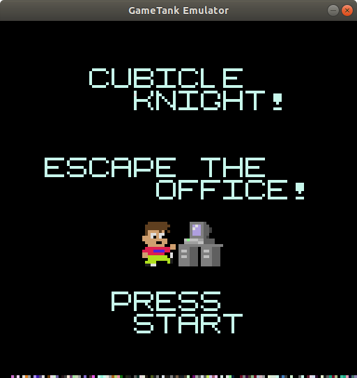
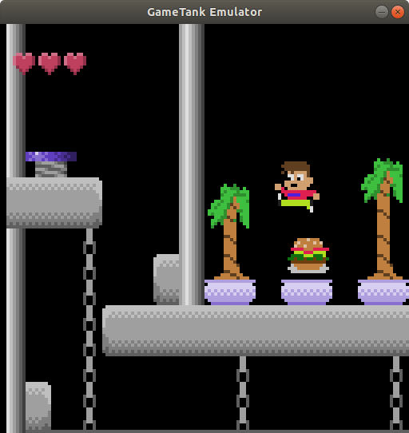

#Cubicle Knight
An adventure game for the GameTank

|  |  |
|-----------------|--------------------|

"make" builds the ROM image

"make emulate" builds the ROM image and runs the emulator, provided ../GameTankeEmulator is available

nodeJS and zopfli are required to rebuild the asset files. so far the automated asset building has only been tested on Linux.
I've been using the vasm assembler but others might be compatible.

cubicle.gtr is the ROM image that can be run in the emulator or flashed to an EEPROM chip. it has been included in the repo in case t